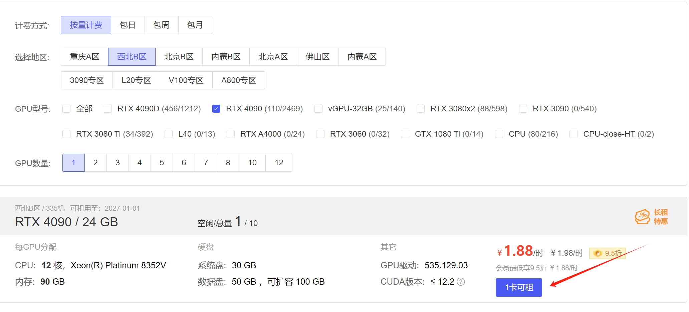
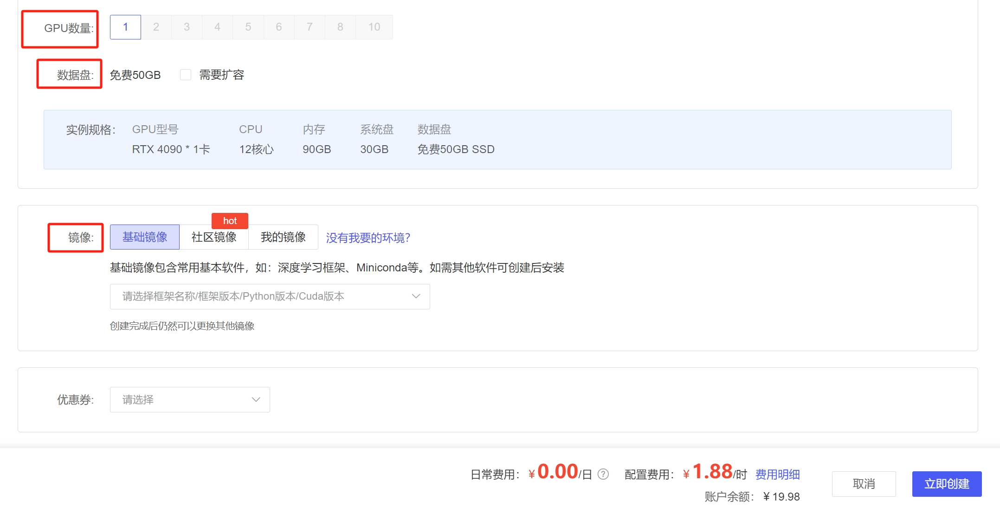
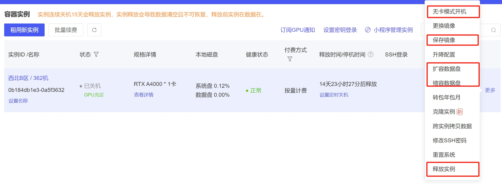

****
# 0.项目介绍
本项目，借助AutoDL平台手把手教如何配置服务器，并在服务器上，利用Pytorch库开始深度学习的新天地。
刚开始学深度学习，需要GPU去跑模型（不然你会后悔的:alien:）。该项目以不同的视觉任务为基础，手把手👌教你：
- **如何配置服务器**💻
- **如何运行代码并验证模型**📂
- **如何部署模型**🛒

不过在项目开始之前，需要教大家如何配置好服务器，demo里的每个项目，只讲解如何上传数据并训练以及......，因此，继续看下去！

# 1.配置服务器

## 1.1.选择服务器

根据自己的实际情况，租用服务器，然后进入下一步
## 1.2.配置服务器

这里需要注意3个位置:
- **GPU数量**：如果需要训练的网络模型大，那么推荐多卡训练。在demo中，便于读者学习，会开发**多卡相关**的代码。
- **数据盘**：这个是否扩容，取决于你的需求。
- **镜像**：这里有三个基本选项，基础镜像、社区镜像和我的镜像：
  - 基础镜像（**刚开始配置建议**）：基础镜像可以配置你的深度学习框架、python版本以及cuda版本，这个没有硬性要求，合适就行了。如果是要学习，建议先选择一次基础镜像，自己在镜像中，不断扩充自己需要的库，然后保存为“我的镜像”
  - 社区镜像：找到其他人已经分享的镜像并使用，这个方便快捷，但是可能有些库没有，仍然需要扩展。
  - 我的镜像（**扩展了其他库以后，建议保存**）：租赁服务器后，在运行过程中，需要不断地填充库，那么保存后的镜像，就是我的镜像。推荐在后续学习的时候，使用这个选项，不过前提是你得有保存镜像！

## 1.3 容器实例
租好服务器以后，进入这个容器实例界面，这里有几个选项，需要特别说明一下

- **无卡模式开机（上传数据时，推荐）**：开机选项是默认带了GPU的，但是传输数据的时候，不需要使用GPU，所以选择无卡更具性价比。建议先选这个，上传完毕，关机重新开机。
- **保存镜像**：在扩充完库以后，建议保存镜像，下次租新的实例，就便于使用。
- **扩/缩数据盘**：根据数据量需求更改。
- **释放实例**：如果释放了实例，下次就需要重新租用，按照**1.1步骤**重头开始，如果只是不使用，关机就行了，没必要释放。

**好了，既然已经学会租赁服务器，那么接下来，就移步到demo里面，开始实战吧，下面是demo有的项目，以及简介：**
- [orange2apple](./demo/orange2apple): 使用cycleGAN网络，将橘子图像转换为苹果图像，进行风格迁移学习。
