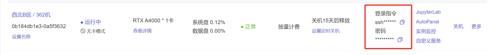
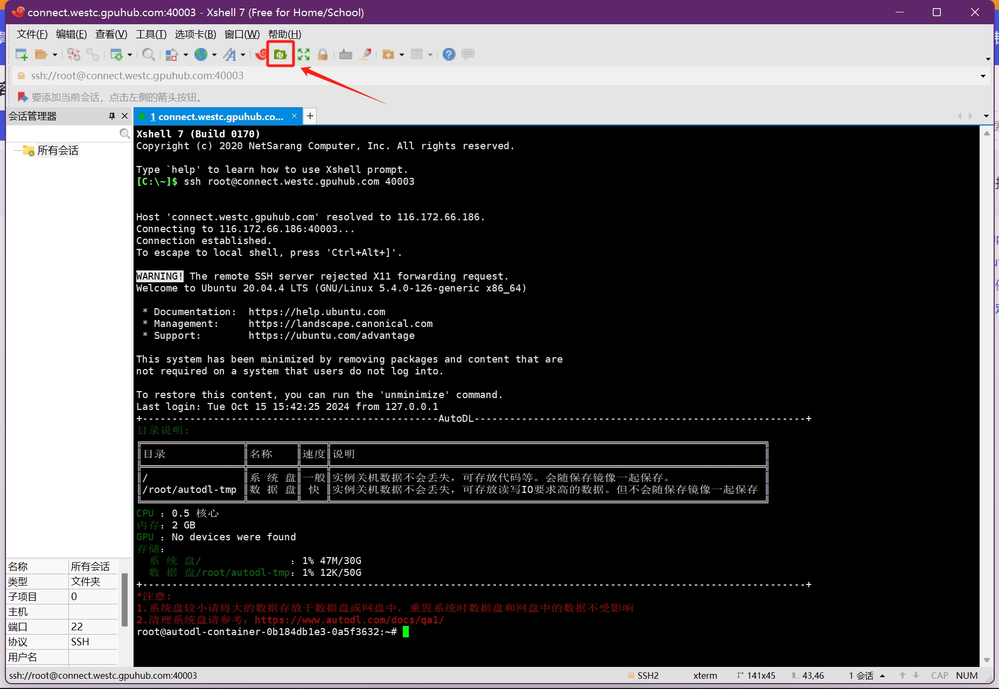
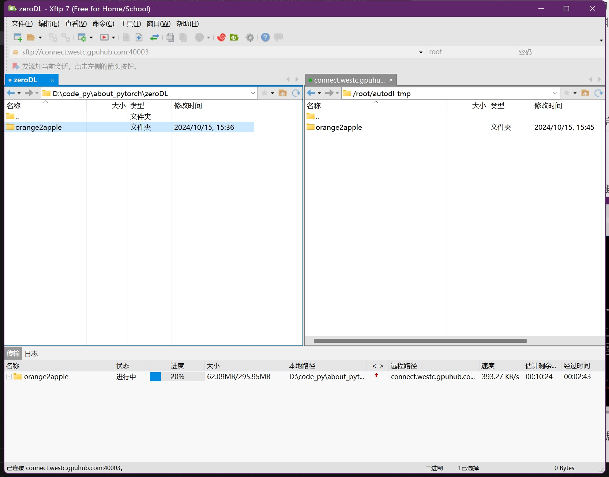
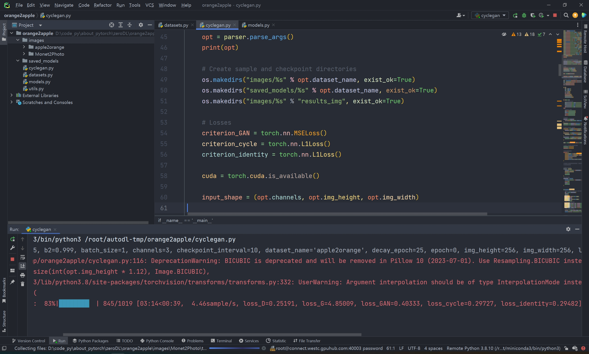
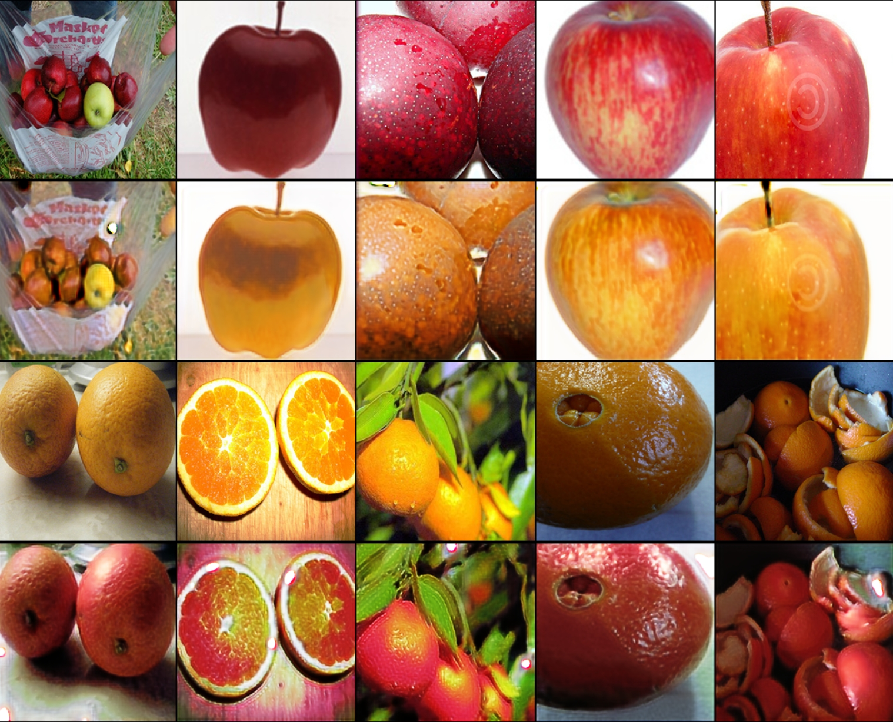

# orange2apple (🍊🉑🍎)
借助AutoDL服务器平台，手把手教如何配置，如何上传数据，以及训练网络到验证，并借助pyqt5进行部署展示。
# 0.  项目介绍
利用cycleGAN网络，进行风格迁移学习，使得网络能够将一张橘子图像转变为苹果图像，混淆视听，想想就非常激动，那接下来，请读者按照以下方法，一步步开始。

# 1. 上传数据
首先将服务器选择**无卡开机模式**，开机完成后，出现以下界面：



然后，根据官网推荐的[Xshell使用](https://www.autodl.com/docs/xshell/)，就能够在Xshell软件上连接好



最后上传数据就行了，我是上传到了数据盘：**/root/autodl-tmp**



**传好以后，记得关机，因为这会儿是无卡模式，没有GPU可用，重新开机后，就可以开始训练网络了！**

# 2. 使用Pycharm连接服务器
根据官网推荐的[pycharm连接](https://www.autodl.com/docs/pycharm/),使用ssh连接服务器。

根据SSH指令，比如我的是
ssh -p 40003 root@connect.westc.gpuhub.com
这说明
```
用户名：root
host：connect.westc.gpuhub.com
端口：40003
```

连接好以后，训练**cyclegan.py**就可以了，如下界面：



这里需要注意的是，前期上传文件目录名是orange2apple，那么在本地pycharm打开的第一级目录也得是orange2apple，**本地与服务器的文件夹目录需要统一**。

# 3. 训练10个epoch后的效果
因为数据集比较小，就没有训练多长，这里做一个展示效果



**橘子被转换成苹果的风格，苹果的风格变成了橘子的风格**
